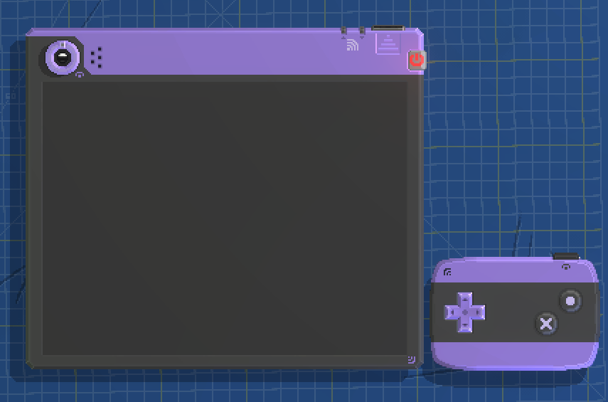
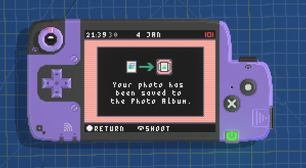

# quartOS (Tango Version)
An application environment for Quartet. 
 

## About
quartOS is less of an Operating System and more so just system software to fulfil the basic use cases for a portable camera currently. 

## What can I do here? 
You're more than welcome to modify and use this source to customise your Quartet gadget, or repurpose it for another gadget. 

Hopefully, I want to further develop quartOS into something more useful for Quartet. 